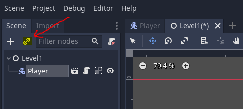
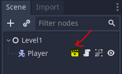
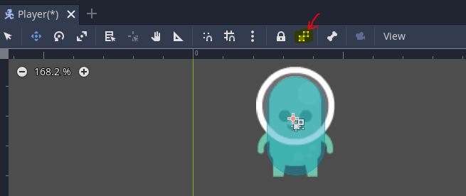
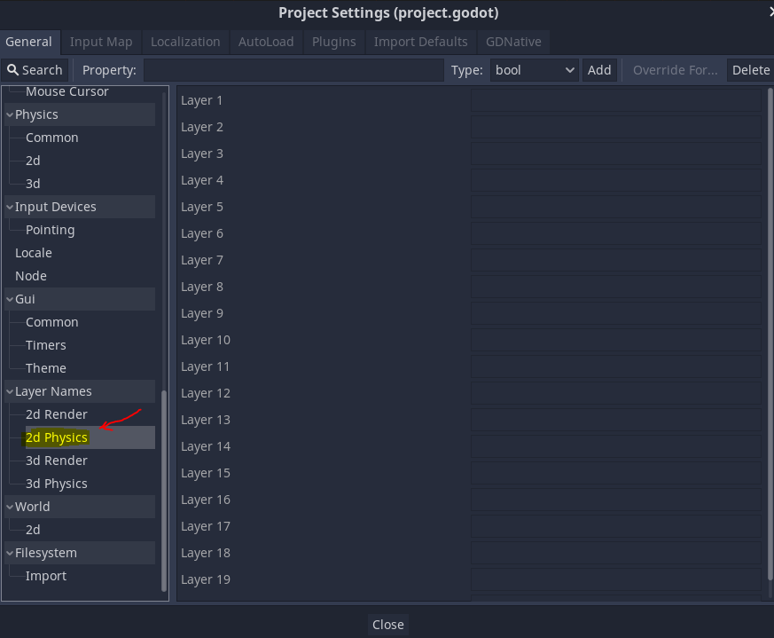
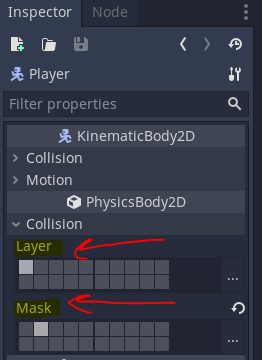

# godot-reference

## Free game resources

### Graphics
[kenney](https://www.kenney.nl/)  
[opengameart](https://opengameart.org)

### Sounds
[opengameart](https://opengameart.org)

## Short keys
F1 - Open documentation.  

## Important object classes

`KinematicBody2D` - Body that is controlled by user.  
`RigidBody2D` - Dynamic body that is not directly controlled by user.  
`StaticBody2D` - Static body like wall, floor, etc.  

## Creating main character
1. Create `KinematicBody2D` scene for the player.
2. Create `AnimatedSprite` child node under player and set the animations.  
3. Create `CollisionShape2D` and choose the needed shape (propably capsule).
4. Create script file for the player. Make sure it inherits `KinematicBody2D`.  
5. Go to `Project Settings`->`Input Map` and configure the input buttons.

## Instancing
We can create scene instance and add it to other scene as a sub node.  
For example, we can create Level scene, and add it an instance of player scene.  
Use the "Instance Child Scene" button.  

Use this button to go to the main scene from its instance.     

## Lock subnodes
Node subnodes can be locked. This can help for moving node and it child nodes together.  

## Creating level tile maps
1. Create TileMap node under the main level node.
2. Import the level sprite sheet.
3. Enable the line grid on the sprite sheet.
4. Press "new auto tile".
5. Adjust the tile grid so it matches the sprites.
6. Set tile collision.
7. Set the tiles on the tile map.

## Layers and Masks
We can devide objects to layers.  
Each layer can be renamed to more human readable name like player, level, etc.  

Layer is represents the object's layer.  
The mask is the layers that the object can interract with.  

# Camera
Camera should be child node of the player node.  
`Current` checkbox will allow camerat to follow player character.  
`Drag margin` and `Smoothing->Speed` can toggle the sensitivity of the camera movments.  

# Paralax Background
`ParallaxBackground` should be child node of the camera.  
`ParallaxBackground` can have few `ParallaxLayer` child nodes.  
Each `ParallaxLayer` should have child node of `TextureRect` for the image.    

Make sure to set `ParallaxBackground`->Scroll->"`Ignore Camera Zoom`".

`ParallaxLayer`->Motion->Mirroring setting should allow to stretch the backgroud   
over the whole level.  

Use the `ParallaxLayer`->Motion->Scale to controll how fast the background is moving.  
Remmember that the most far object should have the lowest scale.  

Use the `ParallaxLayer`->Motion->Offset to controll the background location on the level.  
