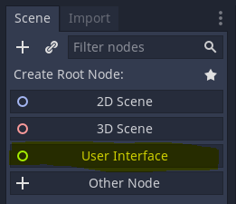
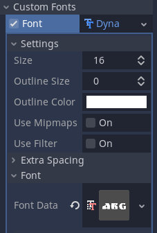
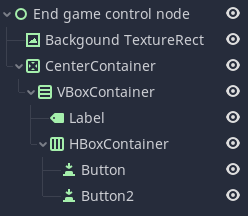
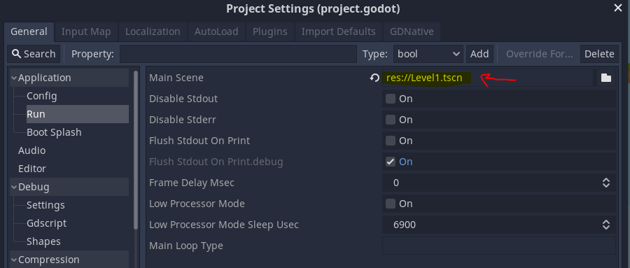
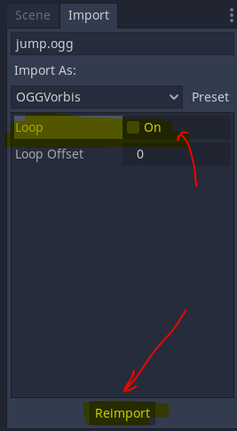
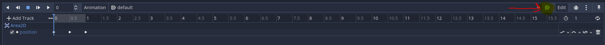
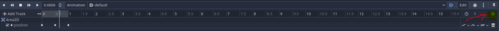

# godot-reference

## Free game resources

### Graphics
[kenney](https://www.kenney.nl/)  
[opengameart](https://opengameart.org)

### Sounds
[opengameart](https://opengameart.org)


## Short keys
F1 - Open documentation  
Ctrl+D - Duplicate object  


## Important object classes

`KinematicBody2D` - Body that is controlled by user.  
`RigidBody2D` - Dynamic body that is not directly controlled by user.  
`StaticBody2D` - Static body like wall, floor, etc.   
`Area2d` - Used for 2D area that has `on_body_entered` signals.  
`AudioStreamPlayer` - Sound player that have no location realted data.  
`AudioStreamPlayer2D` - Sound player that is related to specific point.  
`CanvasLayer` - Layer that has no position. Fits good for GUI.  
`Control` - Base class for all GUI nodes.  
`TextureRect` - For non interactive images and objects.

## Creating main character
1. Create `KinematicBody2D` scene for the player.
2. Create `AnimatedSprite` child node under player and set the animations.  
3. Create `CollisionShape2D` and choose the needed shape (propably capsule).
4. Create script file for the player. Make sure it inherits `KinematicBody2D`.  
5. Go to `Project Settings`->`Input Map` and configure the input buttons.

## Creating user interface scenes
1. Create new user interface scene.  
   
2. Set `Layout` to `Full Rect`.
3. Add chile node of `Texture Rect` and place there the background.  
4. Make sure to set `Layout` to `Full Rect` for the background node.  
5. Add `VboxContainer`s and `HboxContainer`s to layout all interface data.    
6. Add label nodes for text. Set its font to be dynamic and load font data.   


Here is interface scene example:  


## Instancing
We can create scene instance and add it to other scene as a sub node.  
For example, we can create Level scene, and add it an instance of player scene.  
Use the "Instance Child Scene" button.  


Use this button to go to the main scene from its instance.     


## Lock subnodes
Node subnodes can be locked. This can help for moving node and it child nodes together.  


## Creating level tile maps
1. Create TileMap node under the main level node.
2. Import the level sprite sheet.
3. Enable the line grid on the sprite sheet.
4. Press "new auto tile".
5. Adjust the tile grid so it matches the sprites.
6. Set tile collision.
7. Set the tiles on the tile map.

## Layers and Masks
We can devide objects to layers.  
Each layer can be renamed to more human readable name like player, level, etc.  


Layer is represents the object's layer.  
The mask is the layers that the object can interract with.  


## Camera
Camera should be child node of the player node.  
`Current` checkbox will allow camerat to follow player character.  
`Drag margin` and `Smoothing->Speed` can toggle the sensitivity of the camera movments.  

## Paralax Background
`ParallaxBackground` should be child node of the camera.  
`ParallaxBackground` can have few `ParallaxLayer` child nodes.  
Each `ParallaxLayer` should have child node of `TextureRect` for the image.    

Make sure to set `ParallaxBackground`->Scroll->"`Ignore Camera Zoom`".

`ParallaxLayer`->Motion->Mirroring setting should allow to stretch the backgroud   
over the whole level.  

Use the `ParallaxLayer`->Motion->Scale to controll how fast the background is moving.  
Remmember that the most far object should have the lowest scale.  

Use the `ParallaxLayer`->Motion->Offset to controll the background location on the level.  


## Main scene
Main scene is the scene that starts the first.  
It can be set in `Project Settings`.  


## Importing OGG sound files
Make sure to unset the `Loop` flag on imported OGG files.  
This way the sounds will be played once and not loop for ever.  


Sounds can be loaded from the code. It allows one player to play different sounds.  
Here is and example:  
```
$DamageSound.stream = load("res://Sounds/enemy_dying.ogg")
$DamageSound.play()
```

## Signal groups
Signal groups can be used to group logic in single functions.  

For example:  
GameRules signal group can have signals like "take_damage" or "game_over".  
To define `GameRules` signal group create GameRules.gd script under the game level scene. Then add the following code:  

```
func _ready():
	add_to_group("GameRules")

func end_game():
   pass
   // End game logic goes here
```

To call end_game signal, add the following code in the relevant scene code:  
```
get_tree().call_group("GameRules", "end_game")
```

## GUI

1. Create new GUI scene fron `CanvasLayer`.
2. Add `Control` child node.    
3. Set `Control` layout to `Full Rect`.  
4. Add `HBoxContainer` for all the data to be shown.  
5. After GUI scene is ready, add instance of it under your level scene.  

## Adding/Removing scene instances dynamicallty
We can add and remove scene instances dynamically.  
Here is an example, in which we add/remove `TextureRect` scenes  
on the GUI canvas:   
```
func add_lives(lives_number):

   # Adding heart images on the game GUI
	while lives_number > $Control/Lives.get_child_count():
		$Control/Lives.add_child(load("res://Scenes/heart.tscn").instance())
	
	
func remove_lives(lives_number):

   # Removing heart image on the game GUI
	if lives_number <  $Control/Lives.get_child_count():
		var heart =  $Control/Lives.get_child(0)
		heart.queue_free()

```

## Adding objects with animation

1. Create new scene fron `Node2d`.
2. Create child node of `Area2d`.
3. Add `Sprite` and `CollisionShape2d`.
4. Add child node of `AnimationPlayer2d`.
5. In the animation bottom tab, press `Add Track`.  
6. In the `Add Truck` choose the setting you want to animate.
7. Create the animation.
8. Set the animation to `autoplay on load`.
9. Set the animation to `loop`.

### Autoplay on load


### Animation loop

